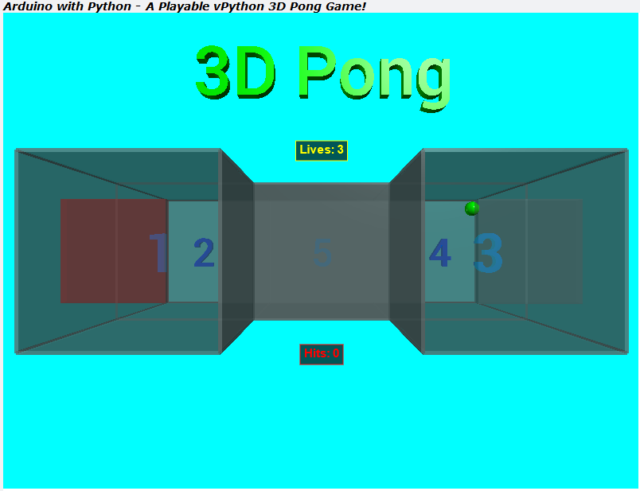
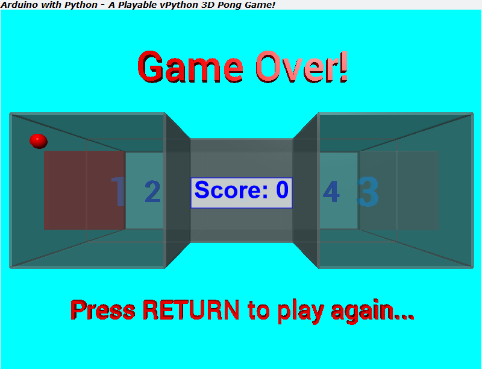
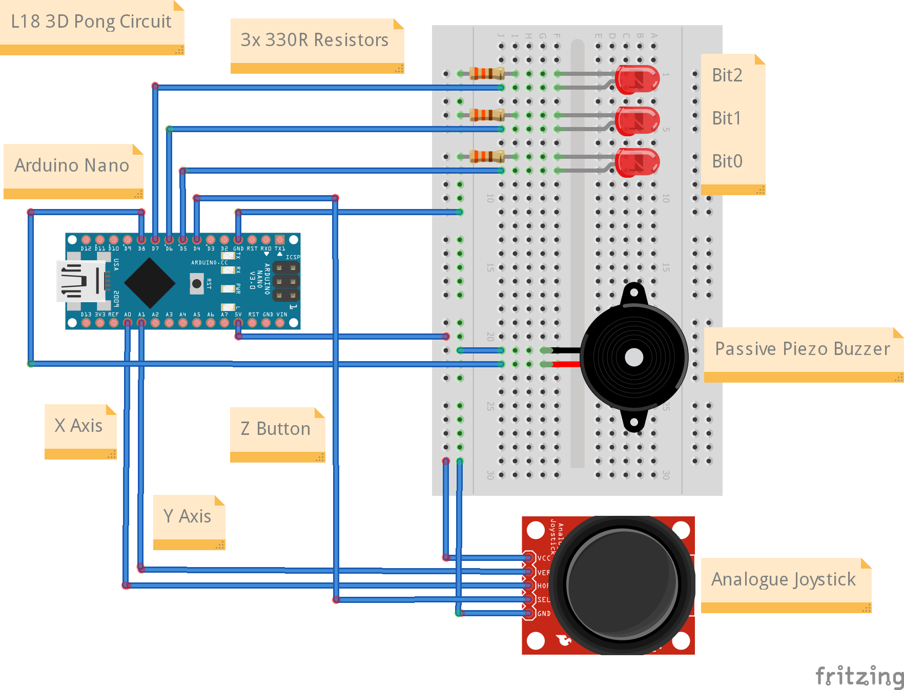

# TTB-AP-Lesson18
My Solution to Paul McWhorter's "Arduino with Python: LESSON 18" homework.

Visit Paul's video here:
 - https://youtu.be/watch?v=czhneFmwJos

You can get Paul's code here:
 - https://toptechboy.com/

You can see my solution demonstrated here:
 - https://youtu.be/3C3D4nD5OkU

This week it was a mix of Arduino and python code. On top of everything I had last week (but with a slightly smaller game arena), I now have a simple client/server setup where the python code can control when the Arduino sends the joystick data. There are also some more gameplay features with lives and a hitcounter now shown on the screen.

To play this 3D Pong game, use the joystick to move the bats to hit the ball. Change the active bat (the red one) using the joystick button. The aim of the game is to stop the bouncing ball from escaping the arena, and each time you hit the ball with a bat you get a point, and the bats are made a little smaller.

## My 3D Pong Game Arena with Bats and a Bouncing Ball - Playing:

## My 3D Pong Game Arena with Bats and a Bouncing Ball - Game Over:

## Arduino Breadboard Circuit Diagram:

